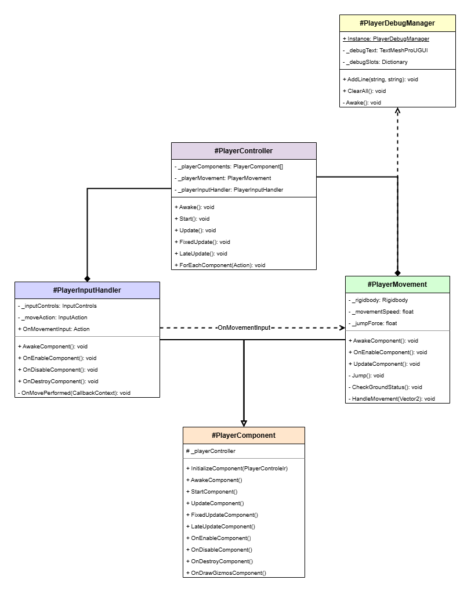

# Player System

## Overview
O sistema de Player gerencia toda a lógica relacionada ao personagem jogável, incluindo movimento, input e componentes relacionados.

## Estrutura de Diretórios

```
Player/
├── Components/
│   ├── PlayerComponent.cs (Base Class)
│   ├── PlayerInputHandler.cs
│   ├── PlayerMovement.cs
│   └── readme.md (Documentação de componentes)
├── PlayerController.cs (Controlador Principal)
└── readme.md (Este arquivo)
```

## PlayerController

**Arquivo:** `PlayerController.cs`

Classe principal que gerencia todos os componentes do jogador e coordena seu ciclo de vida.

### Funcionalidades:
- Inicializa todos os componentes do jogador
- Gerencia o ciclo de vida (Awake, Start, Update, etc.)
- Fornece referências centralizadas aos componentes
- Sincroniza todas as chamadas de método dos componentes

### Componentes Gerenciados:
- `PlayerInputHandler` - Captura de input
- `PlayerMovement` - Movimento e física

### Propriedades Públicas:
```csharp
public PlayerMovement PlayerMovement { get; }
public PlayerInputHandler PlayerInputHandler { get; }
```

### Ciclo de Vida:
```
Awake() → InitializeComponent → AwakeComponent
       ↓
Start() → StartComponent
       ↓
Update() → UpdateComponent
       ↓
OnEnable() → OnEnableComponent
       ↓
OnDisable() → OnDisableComponent
       ↓
OnDestroy() → OnDestroyComponent
       ↓
OnDrawGizmos() → OnDrawGizmosComponent
```

---

## Como Usar

### Acessar Componentes em Outro Script:
```csharp
PlayerController playerController = GetComponent<PlayerController>();
PlayerMovement movement = playerController.PlayerMovement;
PlayerInputHandler input = playerController.PlayerInputHandler;
```

### Adicionar um Novo Componente:
1. Crie uma classe herdando de `PlayerComponent`
2. Implemente os métodos necessários
3. Adicione uma referência serializada no `PlayerController`
4. Inclua no array `_playerComponents` no Awake

---

## Arquitetura do Sistema

Veja o diagrama de classes da arquitetura:



---

## Componentes Disponíveis

Para documentação detalhada sobre cada componente, consulte `Components/readme.md`.

- **PlayerInputHandler** - Sistema de input do jogador
- **PlayerMovement** - Movimento, pulo e física

---

## Notas de Desenvolvimento

- O sistema usa padrão de **Component Pattern** para modularidade
- Comunicação entre componentes via **Events/Delegates**
- Todos os componentes são sincronizados através do `PlayerController`
- Usa o novo **Input System** do Unity para captura de input
